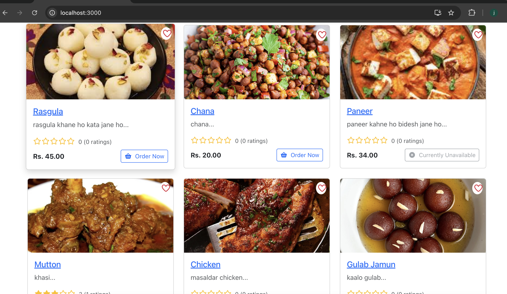
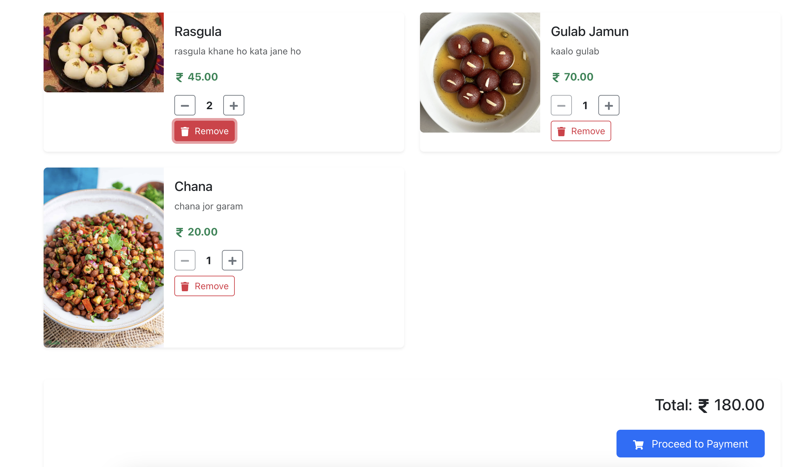
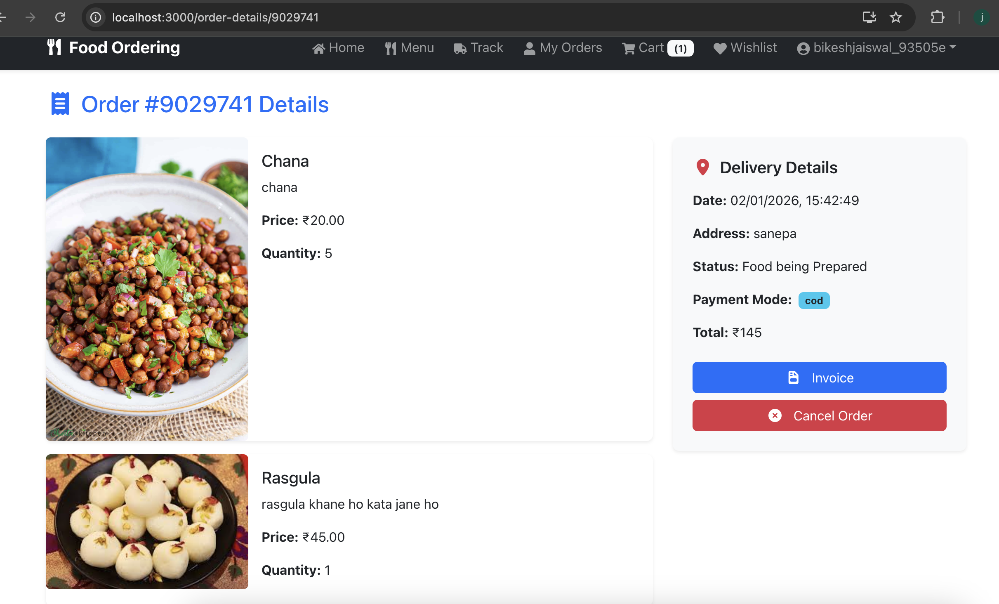
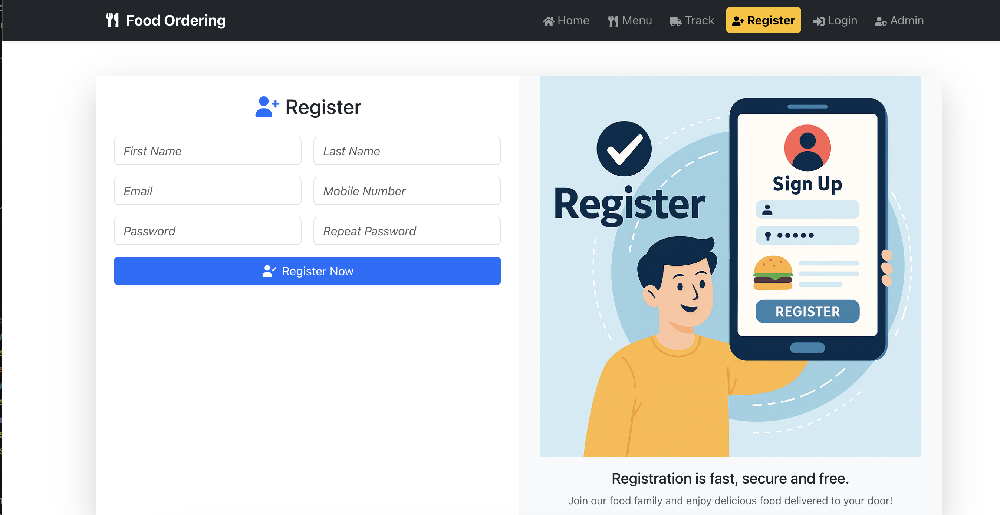
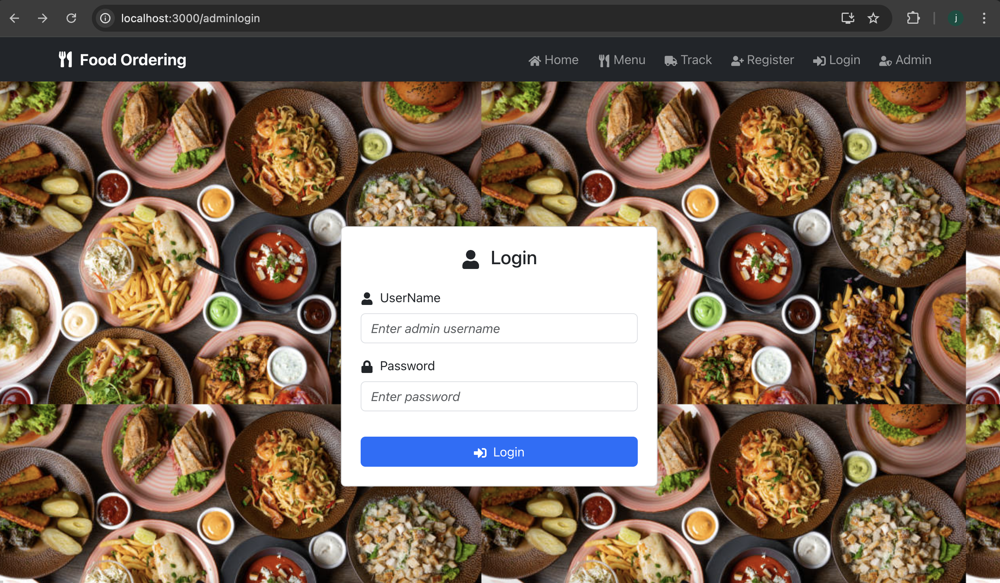
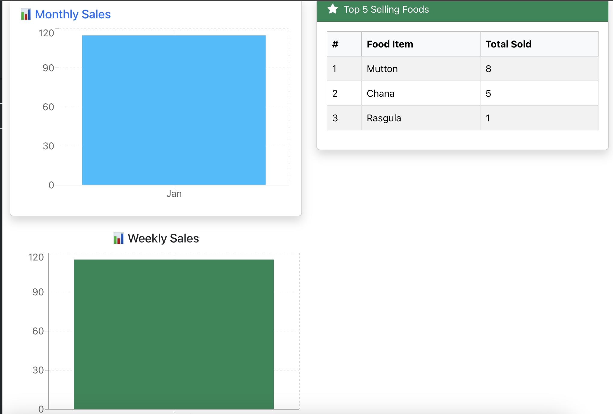
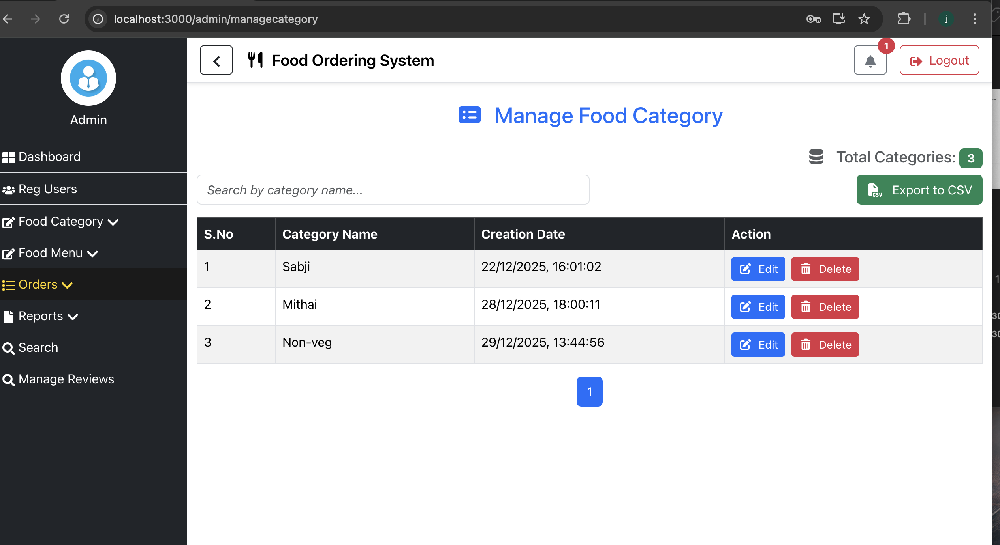
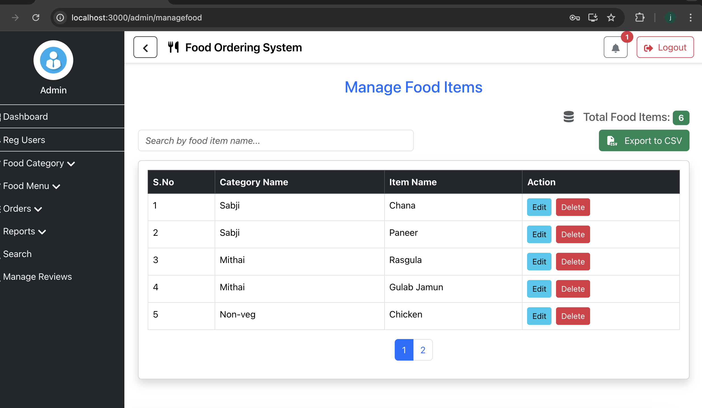
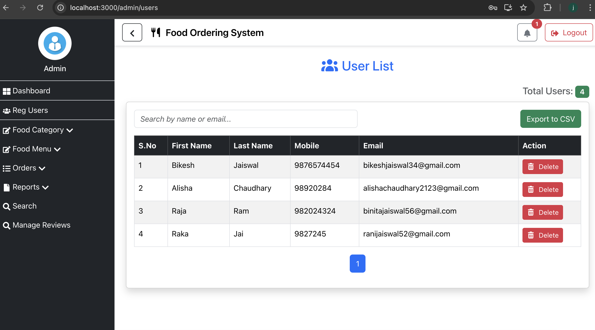
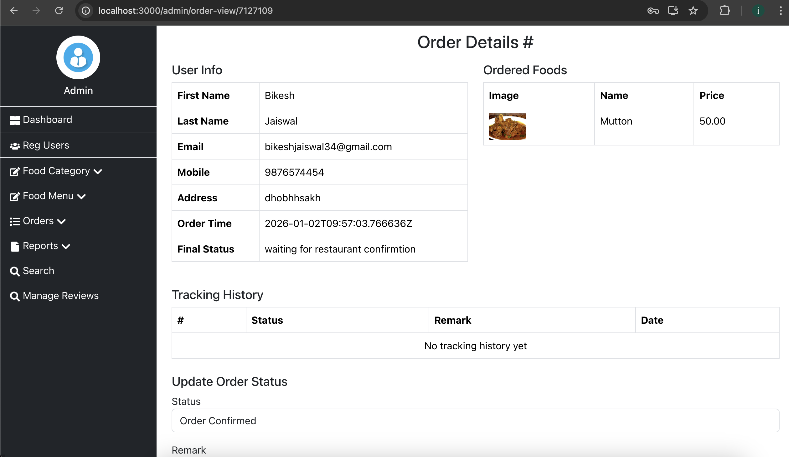

# 🍽️ Food Ordering System

A full-stack **Food Ordering System** that allows users to browse food items, add them to a cart, and place orders.  
The project includes **JWT-based authentication** and an admin panel for managing food items, categories, and orders.

Built using **Django REST Framework** for the backend and **React** for the frontend.

---

## ✨ Features

### 👤 User Features
- User registration and login
- JWT-based authentication
- Browse food items by category
- Add food items to cart
- Place food orders
- View order history and order details
- View order tracking
- Add to wishlist
- Payment with cash and card
  

### 🛠️ Admin Features
- Admin login
- Manage food categories
- Add, update, and delete food items
- View all customer orders
- Update order status
- Manage users
- Manage Review

---

## 🔐 Authentication & Authorization

- JWT (JSON Web Token) based authentication
- Access token stored on client side
- Protected API endpoints
- Role-based access for admin and users

---

## 🧰 Tech Stack

### Backend
- Django
- Django REST Framework
- Simple JWT (Authentication)
- SQLite 

### Frontend
- React
- React Router
- Axios
- JavaScript
- HTML
- CSS

### Tools
- Git & GitHub
- Postman (API testing)

---

## 📸 Screenshots

### 🏠 Home Page

### 🛒 Cart Page

### 📦 Order Details Page

### 📝 Registration Page

### 🔐 Admin Login

### 🛠️ Admin Dashboard

### 📂 Manage Category

### 🍔 Manage Food

### 👥 Manage User

### 📦 Admin View Orders

Â

